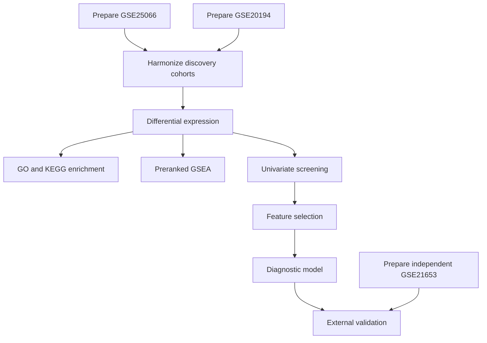

# medflow-bioinfo

Agent-driven bioinformatics workflow framework. MedFlow turns intent-first
scientific protocols into audited, executable multi-node workflows without a
hardcoded DAG or compiled orchestration program.

## How It Works

1. **Protocol** — describe the research question, datasets, comparisons,
   scientific preferences, semantic analysis stages, and quality gates.
2. **Compile** — `medflow-compile` clones current node contracts from
   `registry.yaml`, maps protocol intent to compatible capabilities, and writes
   immutable schema-2.0 `workflow.json` with semantic step intent, node commit
   SHAs, explicit file bindings, and no runtime output directories.
3. **Audit** — `medflow-audit` checks configuration, data compatibility, sample
   identifiers, node revisions, and runtime dependencies. Deferred checks allow
   only prerequisite fetch steps before the audit is repeated. Safe repairs may
   edit a pinned node checkout or create run-local adapter code, but every
   repair must be labeled, bundled, reproducible, tested, and re-audited.
4. **Run** — `medflow-run` creates a workflow registry, immutable full plan
   snapshots, and one UUIDv4 workspace per node attempt. It reviews each
   terminal attempt before selecting, rerunning, replacing, halting, or
   escalating, and traces dependency effects before downstream execution.
5. **Cleanup** — `medflow-cleanup` runs only when explicitly requested by the
   user, inventories eligible terminal attempts, and requires confirmation
   before deletion.

## Project Structure

```text
medflow-bioinfo/
├── .claude/skills/           # Compile, audit, run, and cleanup instructions
├── protocols/
│   └── 9-node-breast-cancer.md
├── workflows/                # Generated workflow JSON files
├── nodes/                    # Fresh registry clones; gitignored
├── runs/                     # Runtime environments and outputs; gitignored
├── registry.yaml             # Node Git URLs and declared versions
├── CLAUDE.md                 # Agent-facing project instructions
└── subagent-test-prompt.md   # Clean-sandbox integration-test prompt
```

## Available Nodes

| Node | Subcommands | Purpose |
|------|-------------|---------|
| `geo-microarray-processing` | `fetch`, `qc`, `clean`, `validate-input`, `validate-output` | Fetch and prepare GEO microarray expression, metadata, and group assignments |
| `batch-correction` | `intersect` | Intersect gene-level datasets, apply ComBat, perform PCA/boxplot QC, and emit a reproducibility bundle |
| `differential-analysis` | `run`, `validate-input`, `validate-output` | Differential analysis with count- and normalized-expression methods, figures, and reproducibility code |
| `univariate-filter` | `run` | Screen features with binary, multi-group, continuous, survival, or correlation models |
| `ml-feature-selection` | `sequential`, `parallel` | Select features using Random Forest, LASSO, consensus, and convergence gates |
| `diagnostic-model` | `train`, `valid`, `evaluate`, `visualize` | Fit and internally assess multivariable logistic diagnostic models |
| `go-kegg-enrichment` | `enrich`, `merge`, `plot-bar`, `plot-bubble`, `plot-net`, `plot-emap` | Perform GO/KEGG over-representation analysis and visualization |
| `gsea-enrichment` | `run`, `filter` | Perform preranked GSEA from differential-expression ranks and a GMT database |
| `external-validation` | `validate`, `dca` | Apply a locked model to an independent expression cohort and assess transportability |

## Reference Protocol

The intent-first [nine-node breast-cancer protocol](protocols/9-node-breast-cancer.md)
compares ER-positive and ER-negative tumors using two GPL96 discovery cohorts
and a separate GPL570 validation cohort.

"Nine-node" refers to nine distinct registered node package types. The DAG has
11 step instances because the GEO preparation capability is instantiated once
for each of the three cohorts.



- **Comparison:** ER-positive relative to ER-negative
- **Discovery:** GSE25066 and GSE20194, GPL96
- **External validation:** GSE21653, GPL570; excluded from all training choices
- **Branches:** GO/KEGG enrichment, preranked GSEA, and diagnostic-signature
  development with independent validation

Recompile the protocol before execution. Historical seven-node workflows and
reports describe earlier runs and are not execution specifications for the
nine-node protocol.

## Registry and Reproducibility

- `registry.yaml` is the authoritative source for node Git URLs and declared
  versions.
- Every freshly cloned node's pinned `SKILL.md` is the authoritative source for
  capabilities, parameters, defaults, inputs, outputs, discovery behavior, and
  conditional results. The agent builds the needed catalog at compile time and
  verifies it against the node entry point. The workflow records the contract
  hash plus each filled parameter's source and rationale.
- Declared registry versions are not commit pins. Compilation resolves the
  current remote default branch and persists its exact commit SHA in the
  workflow. Audit and run must verify or check out that same SHA even if the
  remote branch advances later.
- Nodes must be cloned fresh from registry URLs. Existing `nodes/` contents are
  not a reproducible source and may contain local work.
- External reference data must be declared in `external_inputs` with release
  provenance and checksums.

## Audit Remediation

`medflow-audit` may repair contract-preserving implementation defects and write
deterministic input adapters. It never overwrites raw inputs. Every repair is
stored under `workflows/remediations/<workflow>/<finding-id>/` with:

- `label: MEDFLOW_AUDIT_GENERATED_REMEDIATION`;
- base node URL/version/commit and original workflow checksum;
- runnable source code or a complete node patch;
- raw-input, code, patch, and output checksums;
- exact commands, environment, seeds, logs, tests, and re-audit evidence.

Repairs that change scientific meaning or the public node contract still
require explicit user confirmation. A remediated audit writes a separate
`workflows/<name>.audited.json`; the original compiled workflow remains
unchanged.

## Workflow Runs and Node Attempts

Each new run uses
`runs/<workflow-name>/<UTC-timestamp>-<random-suffix>/`. Its
`workflow-run.json` points to one immutable complete plan snapshot through
`active_plan_id`. The original `workflow.json` starts the run but is never used
directly for resumed dispatch. Schema 1.x workflows must be recompiled.

Every node attempt receives an unordered UUIDv4 workspace beneath
`workspaces/<step-id>/<attempt-uuid>/`. A designed multi-command exploration is
one attempt. Once the node exits, its factual status and review are recorded,
the workspace becomes immutable, and the agent records `select`, `rerun`,
`replace`, `halt`, or `escalate`. A zero exit code does not imply selection.

Pinned node checkouts live outside `--outdir` under
`sources/<attempt-uuid>/node/`; workflow-owned attempt locks live under
`attempt-locks/`. The node alone owns the workspace `run.json`.

Every changed parameter or binding is written to a new complete candidate plan
and receives a focused audit before that plan becomes active. Replacement nodes are selected
only from the registry and audited against immutable step intent. Replacement
or downstream binding changes create a new complete plan snapshot rather than
a delta-only patch. Selecting a new upstream attempt marks dependent attempts
stale until the agent rebinds, reruns, replaces, halts, or escalates them.

Scientific-intent, contract, result-semantic, or downstream-interpretation
changes require user confirmation. Contract-preserving code edits and adapters
continue to use
the full audit-remediation bundle instead.

## Integration Constraints

- GSEA requires a human GMT gene-set database that is not produced by another
  workflow node. Compilation must resolve or request the exact source and
  release before execution.
- External validation requires an independent cohort, the locked selected-gene
  list, and raw logistic beta coefficients. Odds ratios are not valid scoring
  coefficients. Under the current node contract, every locked model gene must
  exist in the external matrix; a missing gene stops validation rather than
  permitting refitting, imputation, or silent feature removal.
- At the currently inspected external-validation revision, the implementation
  writes a raw linear score under a probability column without applying an
  intercept or inverse-logit transformation. Treat probability calibration and
  decision-curve claims as unsafe until that node implementation is corrected.
- KEGG results and some GSEA pathway plots are conditional on external service
  or optional-package availability; their absence must be reported explicitly.

## Language

Use English for artifacts, commit messages, and agent communication.
