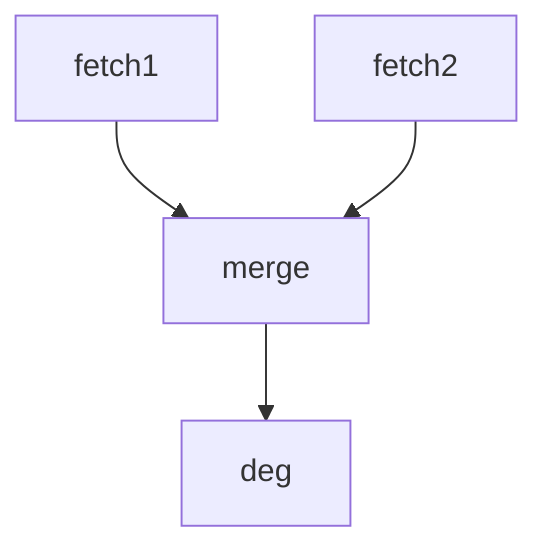

# Protocol: 3-Node Breast Cancer DEG Pipeline

**Planner Agent:** manual-test | **Confidence:** high | **Decision:** proceed

---

## research_question

Compare estrogen receptor positive (ER+) vs estrogen receptor negative (ER-) breast cancer
tumors to identify differentially expressed genes. ER status is the most established molecular
classifier in breast cancer — ER+ and ER- tumors have distinct transcriptional programs,
prognosis, and treatment responses. Grouping by `er_status` column (P = positive, N = negative).

**Group column:** `er_status`
**Group labels:** `P` (ER-positive) vs `N` (ER-negative)
**Datasets:** GSE25066 + GSE20194 (breast cancer, GPL96 platform)

---

## config

```yaml
fetch1:
  subcommand: fetch
  gse_id: GSE25066
  proxy: null
  api_key: null

fetch2:
  subcommand: fetch
  gse_id: GSE20194
  proxy: null
  api_key: null

merge:
  subcommand: union

deg:
  subcommand: run
  group_col: er_status
```

---

## 5. analysis_pipeline

### Workflow Diagram



### Detailed Steps

| Step | Method | Tool/R Package | Input | Output | Quality Gate | Fallback |
|------|--------|----------------|-------|--------|--------------|----------|
| fetch1 | GEO data retrieval | geo-microarray-processing | — | probe + gene expression + metadata | — | — |
| fetch2 | GEO data retrieval | geo-microarray-processing | — | probe + gene expression + metadata | — | — |
| merge | Batch correction merge | batch-correction | gene expression matrices | merged expression + metadata | — | — |
| deg | Differential expression (ER+ vs ER-) | differential-analysis | merged expression, sample metadata | DEGs, volcano, heatmap | — | — |

---

## 9. quality_gates_and_veto_rules

(no gates — first multi-node test)

---
