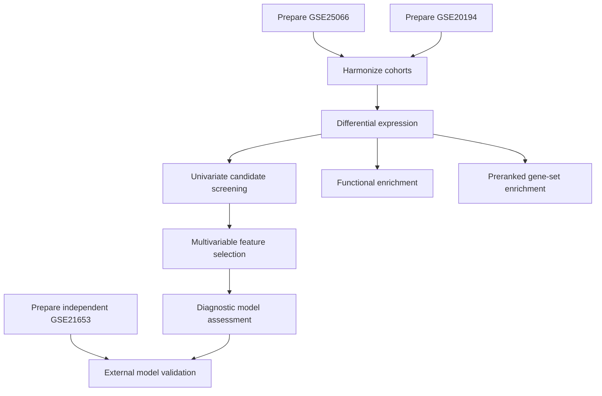

# Protocol: Breast Cancer ER-Status Analysis

**Source:** agent-parsed research request

**Purpose:** MedFlow multi-step integration test

**Decision:** proceed

The protocol exercises nine distinct registered node package types across 11
step instances because cohort preparation is instantiated separately for each
of the three datasets.

## research_question

Compare estrogen receptor positive (ER+) and estrogen receptor negative (ER-)
breast cancer tumors to identify transcriptional differences, characterize the
affected biological pathways, derive a compact diagnostic gene signature, and
test whether that locked signature transports to an independent cohort.

Use the public microarray cohorts GSE25066 and GSE20194. Treat `P` as
ER-positive and `N` as ER-negative. The cohorts use different metadata field
names for the same biological concept, so their ER-status annotations must be
harmonized before joint analysis.

Use GSE21653 only for external validation. It must not influence differential
expression, feature selection, model fitting, threshold selection, or any other
training decision.

## data_sources

| Dataset | Role | ER-status annotation reported by the dataset |
|---------|------|----------------------------------------------|
| GSE25066 | Discovery cohort | `er_status_ihc`, values `P` and `N` |
| GSE20194 | Discovery cohort | `er_status`, values `P` and `N` |
| GSE21653 | External validation cohort | `er ihc`, where `1` is positive and `0` is negative |

The discovery datasets use the GPL96 platform. The independent validation
dataset uses GPL570, so validation must operate on harmonized gene identifiers
and report any model genes that cannot be measured. Under the current external
validation contract, every locked model gene is required; any missing gene
vetoes scoring rather than triggering refitting, imputation, or silent feature
removal. Samples without an unambiguous ER-status label should not enter their
respective comparison.

## analysis_preferences

- Retrieve and prepare gene-level expression data and sample metadata for both
  cohorts.
- Harmonize the two ER-status annotations into one comparison variable.
- Combine the cohorts at the shared-gene level and adjust for study-specific
  batch effects before joint analysis. Report evidence that the adjustment did
  not erase the ER-status signal.
- Use a differential-expression method suitable for normalized microarray
  measurements. Treat an absolute log2 fold change of 0.5 as the minimum
  effect-size threshold. Define the contrast as ER-positive relative to
  ER-negative, so a positive fold change means higher expression in ER-positive
  tumors.
- Perform functional enrichment for human genes using the differentially
  expressed candidates.
- Perform preranked gene-set enrichment using the complete ranked
  differential-expression result and a documented human GMT gene-set release.
  Record the database name, release, source, and checksum.
- Screen candidate genes for individual association with ER status while
  controlling the false-discovery rate at 0.10.
- Reduce the screened candidates to a compact signature using complementary
  tree-based and sparse-regression evidence.
- Fit and internally evaluate a multivariable diagnostic model using the
  selected signature. Report discrimination, calibration, and clinical-utility
  evidence without treating an arbitrary performance threshold as proof of
  validity.
- Lock the fitted model and apply it without refitting to GSE21653. Report
  external discrimination, calibration limitations, risk stratification, and
  decision-curve evidence separately from internal performance.

## analysis_pipeline

## expected_agent_interpretation

The compilation agent should translate the scientific steps into available
registry capabilities and determine the required execution details. In
particular, it should:

1. Resolve one data-preparation operation for each cohort and keep the external
   validation cohort isolated from discovery and training.
2. Recognize that the two ER-status fields are biologically equivalent and
   create a unified binary comparison without silently dropping one cohort.
3. Select compatible cohort-harmonization and differential-expression methods
   after inspecting the actual data type.
4. Branch the differential-expression result into over-representation
   enrichment, preranked gene-set enrichment, and diagnostic-signature
   development. Resolve the required human GMT resource as an external input
   with recorded provenance.
5. Connect the candidate screen, feature-selection stage, and diagnostic model
   using compatible expression, sample-label, and gene-list artifacts.
6. Use the registry only to clone candidate nodes. Infer node packages,
   versions, subcommands, command-line arguments, file bindings, output
   locations, and conditional outputs from each pinned node's `SKILL.md`,
   verified against its entry point.
7. Use documented node defaults for unspecified implementation choices and
   record every applied default. Escalate only when no compatible default
   exists or when the remaining choice changes the scientific interpretation.
8. Pass a locked model representation compatible with external scoring. Do not
   substitute odds ratios for raw model coefficients, refit on GSE21653, or
   reuse internal predictions as external validation.

Node names, command syntax, filenames, and complete node output lists are
intentionally absent. Their successful resolution is part of this test.

## quality_gates_and_veto_rules

- Both cohorts must contribute samples with valid ER-status labels.
- Expression columns and metadata identifiers must be aligned before any
  statistical comparison.
- The combined analysis must retain only comparable gene identifiers and must
  document whether batch adjustment was applied.
- Review study-colored PCA before and after adjustment. The batch gate passes
  only when study-driven separation is reduced, no discovery samples are lost
  unexpectedly, and both ER groups remain represented after adjustment. If
  those conditions cannot be determined from produced evidence, require manual
  review rather than assuming success.
- Differential-expression direction must follow the declared ER-positive
  relative to ER-negative contrast and must not be reversed silently.
- Feature selection and model evaluation must avoid information leakage. If
  evaluation is internal only, the result must be described as internal rather
  than independent validation.
- Feature selection must return at least two measurable, non-duplicated genes
  with estimable model coefficients; otherwise diagnostic modeling is vetoed.
- GSE21653 must remain untouched until the model, features, coefficients, and
  scoring rules are locked. External validation must report cohort/platform
  differences and missing model genes. Any missing locked model gene vetoes the
  validation run under the current node contract.
- Gene-set enrichment must use the full ranked result rather than only the
  thresholded differentially expressed subset, and its GMT provenance must be
  reproducible.
- Missing conditional outputs or unavailable external enrichment results must
  be reported explicitly rather than replaced with fabricated artifacts.
- Any unresolved group mapping, incompatible data type, empty candidate set,
  or failed required analysis step vetoes downstream interpretation.

## expected_report

Report the interpreted workflow, assumptions made by the agent, status of each
scientific step, provenance of the selected capabilities, files actually
produced, output-contract mismatches, excluded samples, warnings, and the main
biological and diagnostic findings. Distinguish implementation failure from an
analysis that completed correctly but produced no statistically supported
result. Present internal and external model performance separately.
